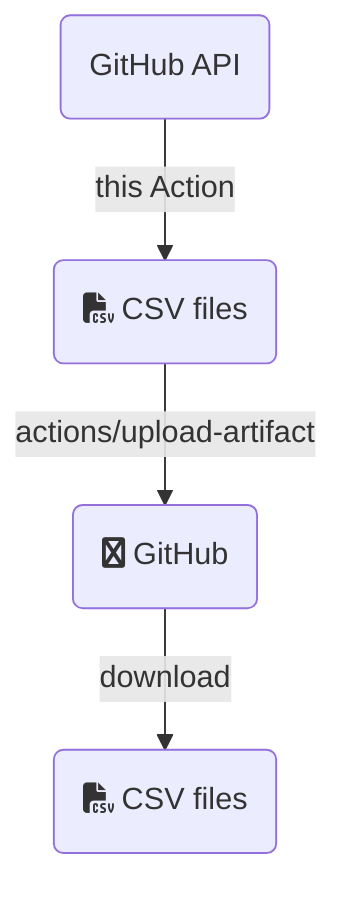

# GitHub Advanced Security to CSV

Simple GitHub Action to scrape the GitHub Advanced Security API and shove it into a CSV.

> **Note**
>
> You need to set and store a PAT because the built-in `GITHUB_TOKEN` doesn't have the appropriate permissions for this Action to get all of the alerts.

## What?

GitHub Advanced Security can compile a _ton_ of information on the vulnerabalities in your project's [code](https://github.com/features/security/code), [supply chain](https://github.com/features/security/software-supply-chain), and any [secrets](https://docs.github.com/en/enterprise-cloud@latest/code-security/secret-scanning/about-secret-scanning) (like API keys or other sensitive info) that might have been accidentally exposed.  That information is surfaced in the repository, organization, or enterprise [security overview](https://docs.github.com/en/enterprise-cloud@latest/code-security/security-overview/about-the-security-overview) and the API.  The overview has all sorts of neat filters and such you can play with.  The API is great and powers all manner of partner integrations, but there's no direct CSV export.

The API changes a bit based on the version of GitHub you're using.  This Action gathers the GitHub API endpoint to use from the runner's [environment variables](https://docs.github.com/en/enterprise-cloud@latest/actions/learn-github-actions/environment-variables#default-environment-variables), so as long as you have a license for Advanced Security, this should work as expected in GitHub Enterprise Server and GitHub AE too.

## Why?

CSV files are the dead-simple ingest point for a ton of other software services you might ~~want~~ have to use in business.  And some people just like CSV files and want to do things in spreadsheets and I'm not here to judge that.  Shine on, you spreadsheet gurus! :sparkles:

## How?

The tl;dr of what this is doing:



Run this thing, then download the artifact.  It's a zip file with the CSV file(s).  You're ready to rock and roll. :)

An example of use is below.  Note that the custom inputs, such as if you are wanting data on a different repo and need additional scopes for that, are set as environmental variables:

```yaml
      - name: CSV export
        uses: some-natalie/ghas-to-csv@v2
        env:
          GITHUB_PAT: ${{ secrets.PAT }}  # you need to set a PAT
      - name: Upload CSV
        uses: actions/upload-artifact@v3
        with:
          name: ghas-data
          path: ${{ github.workspace }}/*.csv
          if-no-files-found: error
```

To run this targeting an organization, here's an example:

```yaml
      - name: CSV export
        uses: some-natalie/ghas-to-csv@v2
        env:
          GITHUB_PAT: ${{ secrets.PAT }}
          GITHUB_REPORT_SCOPE: "organization"
          SCOPE_NAME: "org-name-goes-here"
```

Or for an enterprise:

```yaml
      - name: CSV export
        uses: some-natalie/ghas-to-csv@v2
        env:
          GITHUB_PAT: ${{ secrets.PAT }}
          GITHUB_REPORT_SCOPE: "enterprise"
          SCOPE_NAME: "enterprise-slug-goes-here"
```

## Reporting

|   | GitHub Enterprise Cloud | GitHub Enterprise Server (3.5+) | GitHub AE (M2) | Notes |
| --- | --- | --- | --- | --- |
| Secret scanning | :white_check_mark: Repo<br>:white_check_mark: Org<br>:white_check_mark: Enterprise |  :white_check_mark: Repo<br>:white_check_mark: Org<br>:white_check_mark: Enterprise | :white_check_mark: Repo<br>:x: Org<br>:x: Enterprise | [API docs](https://docs.github.com/en/enterprise-cloud@latest/rest/reference/secret-scanning) |
| Code scanning |  :white_check_mark: Repo<br>:white_check_mark: Org<br>:white_check_mark: Enterprise | :white_check_mark: Repo<br>:white_check_mark: Org<br>:curly_loop: Enterprise |  :white_check_mark: Repo<br>:x: Org<br>:curly_loop: Enterprise | [API docs](https://docs.github.com/en/enterprise-cloud@latest/rest/reference/code-scanning) |
| Dependabot | :white_check_mark: Repo<br>:white_check_mark: Org<br>:white_check_mark: Enterprise | :x: | :x: | [API docs](https://docs.github.com/en/enterprise-cloud@latest/rest/dependabot/alerts) |

:information_source:  All of this reporting requires either public repositories or a GitHub Advanced Security license.

:information_source:  Any item with a :curly_loop: needs some looping logic, since repositories are supported and not higher-level ownership (like orgs or enterprises).  How this looks won't differ much between GHAE or GHES.  In both cases, you'll need an enterprise admin PAT to access the `all_organizations.csv` or `all_repositories.csv` report from `stafftools/reports`, then looping over it in the appropriate scope.  That will tell you about the existence of everything, but not give you permission to access it.  To do that, you'll need to use `ghe-org-admin-promote` in GHES ([link](https://docs.github.com/en/enterprise-server@latest/admin/configuration/configuring-your-enterprise/command-line-utilities#ghe-org-admin-promote)) to own all organizations within the server.

## Sample Actions File

```yaml
name: 🔐 ghas to csv
on:
  workflow_dispatch:
  schedule:
    - cron: '30 22 * * 1'  # Weekly at 22:30 UTC on Mondays
jobs:
  data_gathering:
    runs-on: ubuntu-latest
    steps:
      - name: CSV export
        uses: some-natalie/ghas-to-csv@v2
        env:
          GITHUB_PAT: ${{ secrets.PAT }}
          GITHUB_REPORT_SCOPE: "organization"
          SCOPE_NAME: "joshjohanning-org"
      - name: Upload CSV
        uses: actions/upload-artifact@v3
        with:
          name: ghas-data
          path: ${{ github.workspace }}/*.csv
          if-no-files-found: error
```

## Other notes

[GitHub Copilot](https://copilot.github.com/) wrote most of the Python code in this project.  I mostly just structured the files/functions, wrote some docstrings, accounted for the differences in API versions across the products, and edited what it gave me. :heart:
